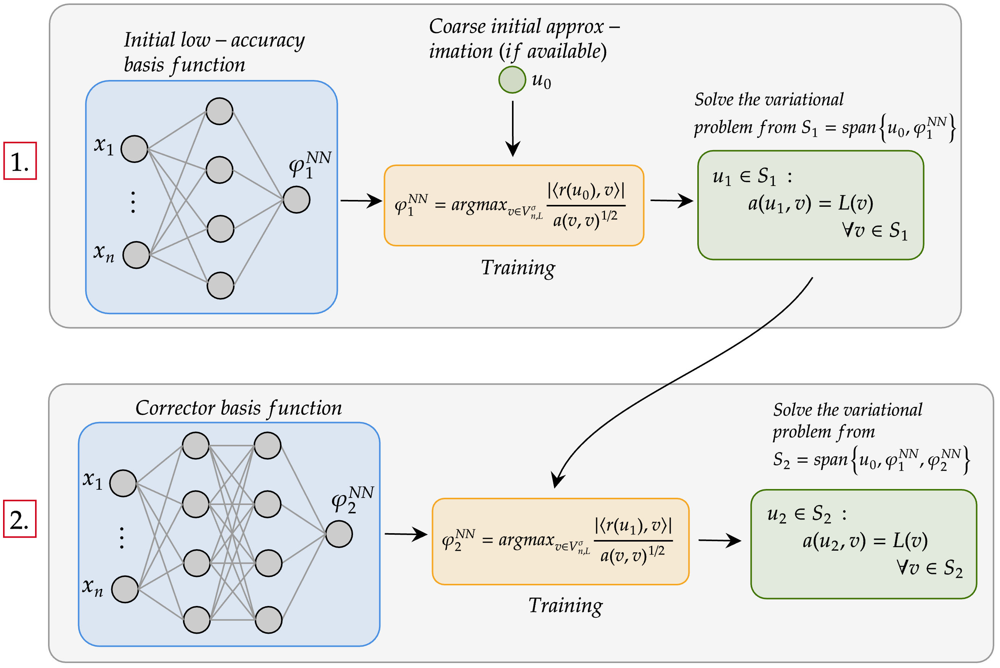

# galerkinNNs
A neural network framework for approximating PDEs with error control. The method consists of constructing a low-dimensional subspace whose basis functions are realizations of DNNs. The basis functions are correctors that aim to eliminate different components of the error in the approximation. The framework is described in full detail in [1] for symmetric, positive-definite (SPD) problems. Extensions to non-SPD problems and so-called extended NN architectures which utilize known singular functions is covered in [2].

*A flowchart of the Galerkin neural network framework.*

Examples included here are:
* Poisson equation in 1D and 2D, including L-shaped domain with extended NN architecture and weighted variational formulation from [2]
* Singularly-perturbed 1D problem demonstrating how to construct variational formulations for use with Galerkin NNs when the underlying problem is not SPD
* Stationary Stokes flow in 2D, including in T-shaped channel with Moffatt eddies from [2]

![Extended Galerkin neural networks from [2]](docs/galerkinNNs_extended.png)
*Galerkin neural network framework with singular extension.*

To do: streamline implementation of variational formulation to reduce number of locations code must be changed when implementing new problems, enable GPU support for matrix assembly

[1] Ainsworth, M., & Dong, J. (2021). [Galerkin neural networks: A framework for approximating variational equations with error control](https://arxiv.org/abs/2105.14094). SIAM Journal on Scientific Computing, 43(4), A2474-A2501.

[2] Ainsworth, M., & Dong, J. (2024). [Extended Galerkin neural network approximation of singular variational problems with error control](https://arxiv.org/abs/2405.00815). arXiv preprint arXiv:2405.00815.

This implementation is built on [JAX](https://github.com/google/jax) and will also require SciPy and matplotlib. Optional packages include joblib (CPU parallelization of linear coefficient updates).
